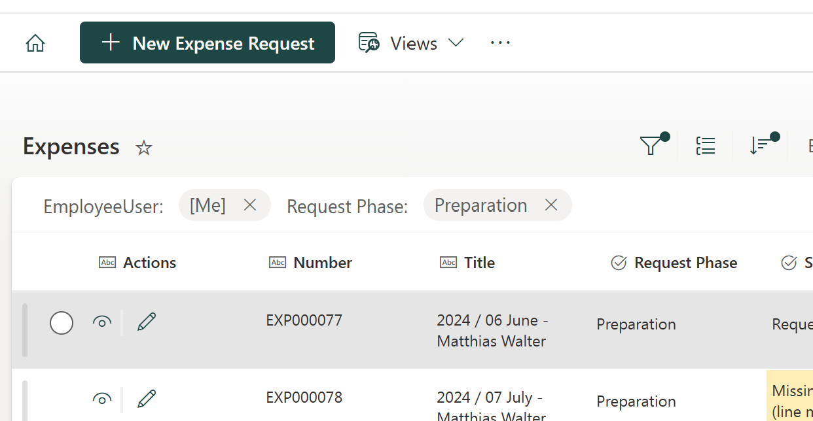

# commandbar-best-practice-style-hide-order
Copy the json and paste it into the view formatting of your desired views.

## Result
* Primary styled new button, 
* some hidden ootb buttons, 
* reordered buttons including skybow List Actions

... on the view's command bar: 

