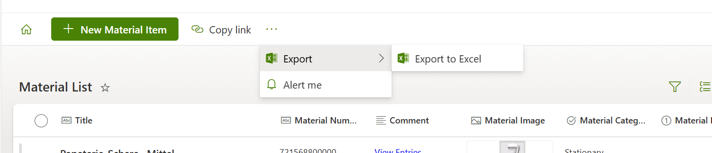

# commandbar-extensive-options-style
Copy the json and paste it into the view formatting of your desired views.

## Result
A clean command bar, with just the new button, the alerts in the overflow section and the additional button Home added as skybow List action.
Plus now the actions you choose to display on purpose - in this case the "Export to Excel" Maintab with only "Export to Excel" as Subtab.

