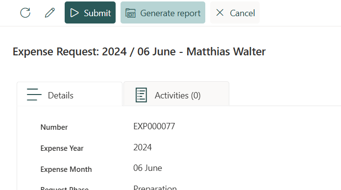
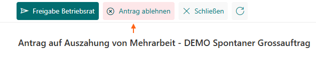
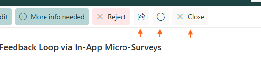

# command-bar-button-style-samples
Use the import functionality to import the provided styles to your forms: [Export/Import](https://my.skybow.com/hc/en-us/articles/360020689240-skybow-Modern-Forms-Styling-Conditional-Formatting-introduction#h_01F1N09T7DK5G14PW3RHAJV91D:~:text=issue%20is%20fixed.-,Export/Import,-There%20are%20a)

## Result
### Buttons on DispForm
Styled as "dark" (position 3 from the left), "light" (at position 4) and "gray" (at position 5)

Styled as "red" for Buttons like Delete, Decline, Cancel

### CommandBar DefaultButtons on Forms
Style all buttons with default style gray when applying the *Styles_CommandBar_DefaultButtons_gray.json* style to your command bar. 

This way your buttons will always look like buttons even if you don't apply a specific style.

