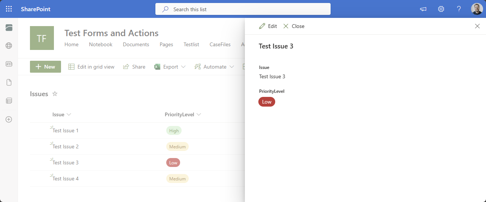

# choice-pill-on-dispform
Use the import functionality to import the provided style directly on the choice field under Control Styles of your form: [Export/Import](https://my.skybow.com/hc/en-us/articles/360020689240-skybow-Modern-Forms-Styling-Conditional-Formatting-introduction#h_01F1N09T7DK5G14PW3RHAJV91D:~:text=issue%20is%20fixed.-,Export/Import,-There%20are%20a)

Adjust the Rule expression to your choice's column name and value to apply style on specific values on forms.

## Result
### DispForm

