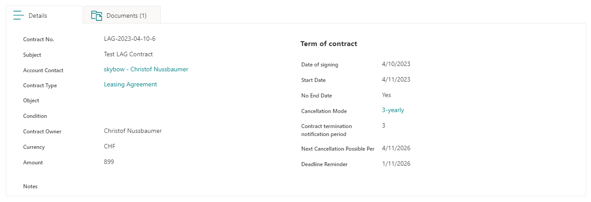
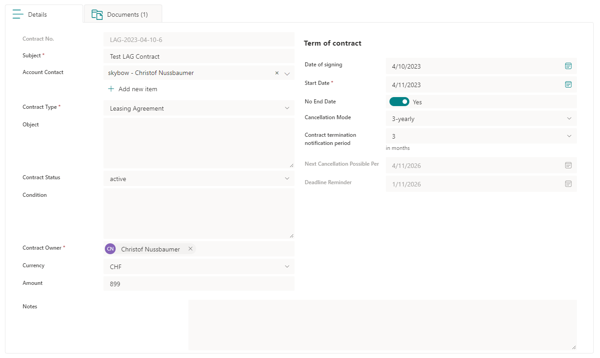
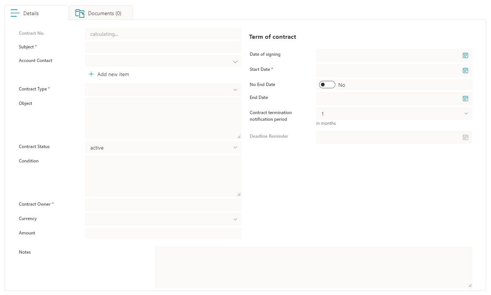

# left-labeled-inputs
Use the import functionality to import the provided styles to your forms: [Export/Import](https://my.skybow.com/hc/en-us/articles/360020689240-skybow-Modern-Forms-Styling-Conditional-Formatting-introduction#h_01F1N09T7DK5G14PW3RHAJV91D:~:text=issue%20is%20fixed.-,Export/Import,-There%20are%20a)
 
## Result
### DispForm

### EditForm

### NewForm
